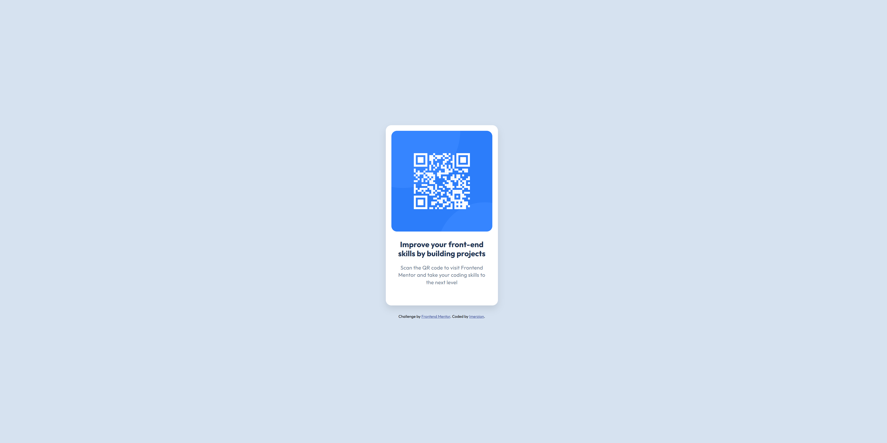

# Frontend Mentor - QR code component solution

This is my solution to the [QR code component challenge on Frontend Mentor](https://frontendmentor.io).

## Table of contents

- [Overview](#overview)
  - [The challenge](#the-challenge)
  - [Screenshot](#screenshot)
  - [Links](#links)
- [My process](#my-process)
  - [Built with](#built-with)
  - [What I learned](#what-i-learned)
- [Author](#author)

## Overview

### The challenge

The challenge was to build out a responsive QR code card component and get it looking as close to the design specification as possible using any tools or workflows preferred.

### Screenshot

### Links

- Solution URL: [Add your Frontend Mentor submission link here]
- Live Site URL: [Add your GitHub Pages live deployment link here]

## My process

### Built with

- Semantic HTML5 markup structures
- CSS Custom Properties (`:root` variables)
- Flexbox structural alignment models
- Mobile-first design workflow scaling

### What I learned

During this project, I practiced isolating system theme colors inside a centralized CSS `:root` scope for clean asset management across the layout.

Basically just refreshing my knowledge of coding to get back into the hobby again.

## Author

- Frontend Mentor - [@Imerzion](https://frontendmentor.io)
